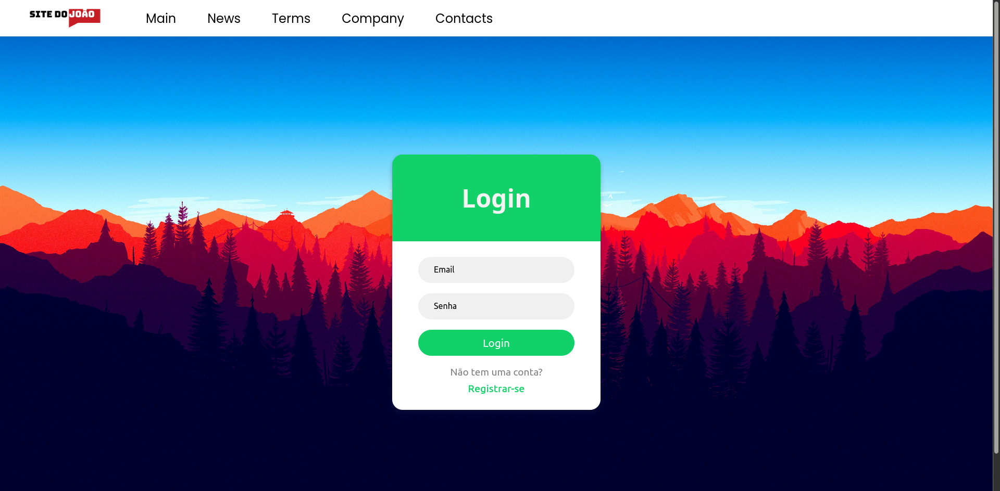

# Site do João Versão 12

Site criado somente para treinos de minhas habilidades de programação, site é duas páginas para registro/login, usando databases.
Criado usando HTML, CSS, SASS, EXPRESS.JS, MYSQL.
Somente um site responsível simples.
Se foram 3 meses programando, agora avançando no backend.

**Site do João 2021**
